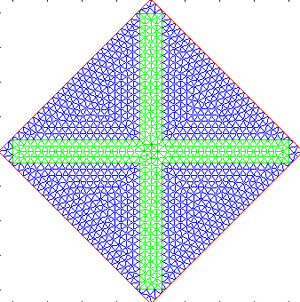
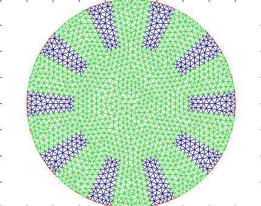

<!-- Add title -->
# ABAQUS Simulation of Soft Kirigami Structures

<!-- Add description -->
## Description
This repository contains the files used to simulate the soft kirigami structures in the paper "Design of bistable soft deployable structures via a Kirigami-inspired
planar fabrication approach" by
Mrunmayi Mungekar, Vishal Kackar, Shyan Shokrazadeh, Wenzhong Yan, Leixin Ma*, and
Mohammad K. Jawed*.

<!-- Add table of contents -->
## Table of Contents
- [Title](#title)
- [Description](#description)
- [Table of Contents](#table-of-contents)
- [Pre-requisites](#pre-requisites)
- [Files](#files)
- [Usage](#usage)
- [Contributing](#contributing)
- [License](#license)

## Pre-requisites
The code is written for ABAQUS 2018 and MATLAB R2022a. The MATLAB code is used to generate the input files for ABAQUS and the Python code is used to post-process the results. Ensure you have a running version of these softwares installed on your system.

## Files
1. > Main.m - This file contains the inputs to the code such as material and geometric properties, pre-stretch, kirigami design, etc. You can also decide whether you want a trilayer or a bilayer simulation.
2. > template.inp - This is the template input file for ABAQUS. The code will generate a new input file for each kirigami design based on this template.
3. > cutoutMesh_cross.m and cutoutMesh_lotus.m - These files are used to generate the mesh design for ABAQUS. The cross-shaped kirigami design is generated by cutoutMesh_cross.m and the lotus-shaped kirigami design is generated by cutoutMesh_lotus.m.
4. > objfun_kirigami_shell.m - The Main file runs this function. The mail goal of this function is to start/stop ABAQUS, run the various functions required for the simulation, and post-process the results.
5. > meshGen_shell.m - This function generates the 3D mesh for the kirigami structure from the design described in the cuoutMesh files. This data then populates the various files that ABAQUS requires as input.
6. > write_input_file.m - This function modifies the input file as required by the codes input.
7. > readODB.py - This file is used to post-process the results from ABAQUS. It reads the .odb file. Currently, it provides the maximum height and stable strain energy for the structure, but can be modified according to user requirements.

## Usage
1. Download the code or pull it from this github repo. 
2. Start ABAQUS license and note the address for your ABAQUS files
3. Design a mesh for your kirigami structure. The code currently supports cross-shaped and lotus-shaped kirigami designs. You can modify the code to support other designs as well.
<figure class="half" style="display:flex">
    <figure>
    
        <figcaption>Cross-shaped Kirigami, Square-shaped substrate</figcaption>
    </figure>
    <figure>
    
        <figcaption>Lotus-shaped Kirigami, Circle-shaped substrate</figcaption>
    </figure>

</figure>
4. Once this is done, you have to change only the Main file of the code to run the simulation. This decides:

* > Trilayer or bilayer simulation: You can decide that in the Main file. The code will generate the input files for ABAQUS accordingly.
* > Material: The code is build on Mooney Rivlin material only (required C1, C2, D). But you can modify the code to use other material types as well.
* > Geometry and Kirigami Designs: You can change the kirigami design and the geometry of the structure in the Main file. Add your created mesh file as a case in the switch statement. You can define structure size, mesh size, thickness, etc.
* > Pre-stretch: You can decide the pre-stretch (lambda) of the structure in the Main file. It calculates the initial stress from this and the material properties.  

(If you need to modify further details or any ABAQUS simulation parameters, you can look at [Files](#files) section to understand the files and modify them accordingly.)

5. Start your ABAQUS license and run the Main file. It will generate the input files for ABAQUS and run the simulation. It will also post-process the results and save them in a .txt file. You can also check the .odb file to see the results of the simulation.  
(Check the progress of your code in the .sta file. Any errors will be displayed in either the .log, .dat or .msg file.)

## Disclaimer
This code does not account for contact modelling. Hence, it is not designed for too high deformations.
<!-- Add contributing -->
## Contributing
Feedback is welcome! For major changes, please open an issue first to discuss what you would like to change.

<!-- License -->
## License

